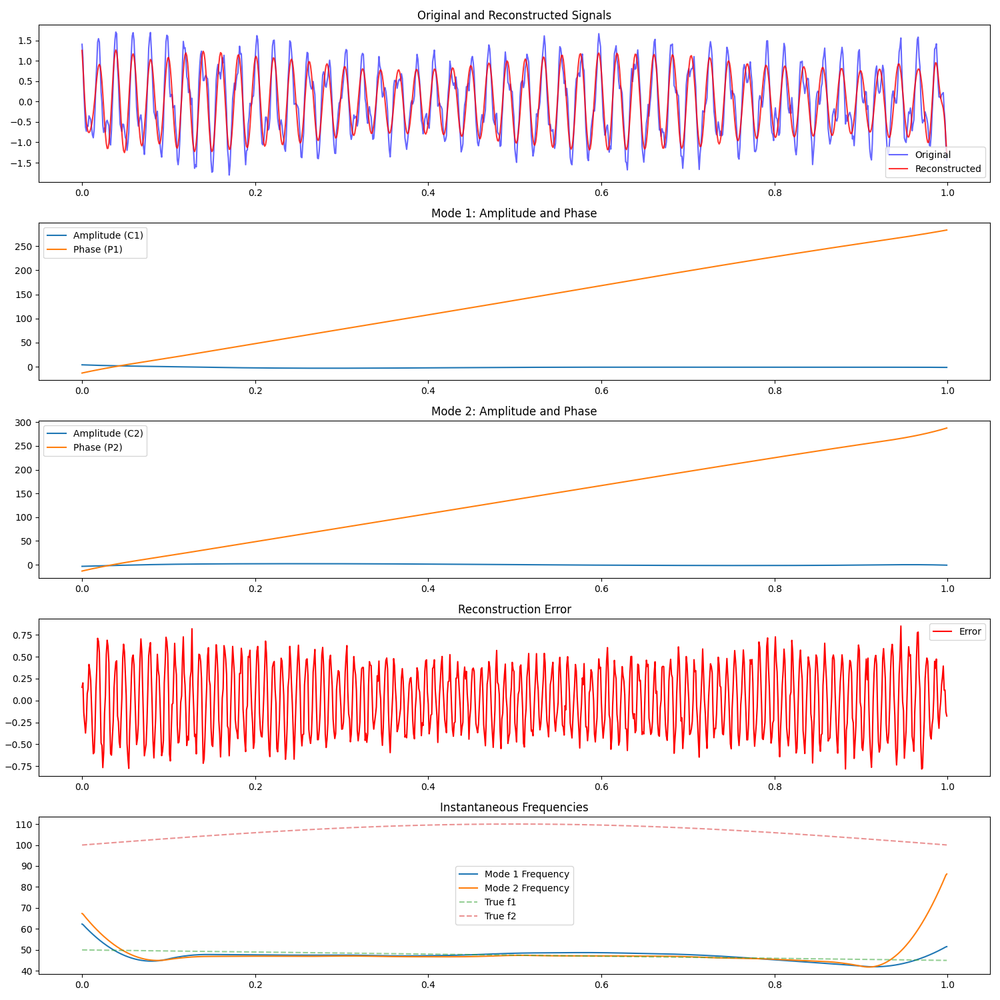

# Leverdier Framework: Adaptive Harmonic Decomposition


## Table of Contents

- [Overview](#overview)
- [Background](#background)
- [Features](#features)
- [Getting Started](#getting-started)
  - [Prerequisites](#prerequisites)
  - [Installation](#installation)
  - [Usage](#usage)
- [How It Works](#how-it-works)
  - [Spline-Based Parameterization](#spline-based-parameterization)
  - [Optimization Process](#optimization-process)
- [Example](#example)
- [Contributing](#contributing)
- [License](#license)
- [Contact](#contact)

## Overview

The **Leverdier Framework** is an innovative approach to harmonic analysis, extending traditional Fourier methods to accommodate time-varying amplitudes and frequencies in complex, nonlinear systems. Named after the hypothetical French mathematician Marcelin Leverdier, this framework offers a robust solution for decomposing signals into adaptive harmonic modes, making it ideal for analyzing dynamic and intricate datasets across various scientific and engineering domains.

## Background

### Harmonic Oscillators

A harmonic oscillator is a fundamental concept in physics, describing systems that experience a restoring force proportional to their displacement from equilibrium. This proportionality results in periodic, sinusoidal motion, which is the cornerstone of classical harmonic analysis.

**Key Characteristics:**

- **Restoring Force:** F = -kx
- **Equation of Motion:** m(d²x/dt²) + kx = 0
- **Solution:** x(t) = A cos(ωt + φ)
- **Energy:** E = (1/2)kA²

**Examples:**

- Mass-spring systems
- Simple pendulums
- LC electrical circuits
- Molecular vibrations

### Limitations of Classical Fourier Analysis

While Fourier analysis is powerful for decomposing signals into static sinusoidal components, it falls short in handling:

- **Nonlinear Systems:** Many real-world systems exhibit nonlinear behaviors that cannot be captured by fixed-frequency sinusoids.
- **Time-Varying Dynamics:** Systems with changing frequencies and amplitudes over time require adaptive analysis methods.
- **High-Dimensional and Coupled Oscillators:** Complex networks of interacting oscillators demand scalable and flexible decomposition techniques.

The Leverdier Framework addresses these limitations by introducing adaptive, time-varying harmonic modes.



## Features

- **Adaptive Mode Extraction:** Dynamically identifies and adjusts harmonic components to fit localized signal segments.
- **Spline-Based Representation:** Utilizes spline functions to efficiently parameterize time-varying amplitudes and phases.
- **Nonlinear Optimization:** Employs gradient-based optimization techniques to refine mode parameters for accurate signal reconstruction.
- **Scalability:** Designed to handle large datasets and high-dimensional signals with multiple interacting modes.
- **Visualization Tools:** Provides comprehensive plots to visualize original and reconstructed signals, amplitude and phase components, reconstruction error, and instantaneous frequencies.

## Getting Started

### Prerequisites

Ensure you have the following installed:

- Python 3.7 or higher
- Pip (Python package installer)

### Installation

1. **Clone the Repository:**

   ```bash
   git clone https://github.com/yourusername/leverdier-framework.git
   cd leverdier-framework
   ```

2. **Create a Virtual Environment (Optional but Recommended):**

   ```bash
   python3 -m venv .venv
   source .venv/bin/activate  # On Windows: .venv\Scripts\activate
   ```

3. **Install Dependencies:**

   ```bash
   pip install -r requirements.txt
   ```

   *If a `requirements.txt` file is not provided, install the necessary packages manually:*

   ```bash
   pip install numpy scipy matplotlib
   ```

### Usage

1. **Prepare Your Signal:**

   Ensure your input signal is a one-dimensional NumPy array sampled at a consistent rate. The provided script includes a mock signal generator for testing purposes.

2. **Run the Script:**

   ```bash
   python leverdier.py
   ```

   This will execute the Leverdier Framework on the mock signal, performing adaptive harmonic decomposition and displaying the results through various plots.

3. **Interpreting the Output:**

   - **Original vs. Reconstructed Signal:** Compare the original noisy signal with the reconstructed signal to assess decomposition quality.
   - **Mode Components:** Visualize the amplitude and phase functions of each extracted mode.
   - **Reconstruction Error:** Analyze the difference between the original and reconstructed signals.
   - **Instantaneous Frequencies:** Examine how the estimated frequencies evolve over time compared to the true frequencies.

## How It Works

### Spline-Based Parameterization

To manage the complexity of time-varying amplitudes and frequencies, the Leverdier Framework employs spline functions to represent the amplitude (`C1`, `C2`) and phase (`P1`, `P2`) of each harmonic mode. This approach significantly reduces the number of parameters, enhancing computational efficiency and ensuring smoothness in the decomposed components.

**Key Steps:**

1. **Initial Spline Fitting:** Fit initial spline curves to the amplitude and phase estimates derived from Short-Time Fourier Transform (STFT) analysis.
2. **Coefficient Extraction:** Extract spline coefficients to form the initial parameter vector for optimization.
3. **Parameter Packing:** Combine all spline coefficients into a single parameter array for streamlined optimization.

### Optimization Process

The core of the Leverdier Framework lies in optimizing the spline coefficients to minimize the reconstruction error while enforcing smoothness through regularization.

**Components:**

- **Cost Function:** Combines the data fidelity term (sum of squared errors between original and reconstructed signals) with a regularization term that penalizes roughness in the spline coefficients.
  
  \[
  J(\{C_n, \Theta_n\}) = \frac{1}{2} \| x(t) - \sum_{n} C_n(t) \cos(\Theta_n(t)) \|_{L^2}^2 + \alpha \sum_{n} \left( \| \Delta^2 C_n \|_{L^2}^2 + \| \Delta^2 \Theta_n \|_{L^2}^2 \right)
  \]

- **Gradient Computation:** Uses finite differences to approximate the gradient of the cost function with respect to each spline coefficient.
- **Optimization Algorithm:** Utilizes the L-BFGS-B algorithm, a quasi-Newton method suitable for large-scale optimization problems with bound constraints.

**Process:**

1. **Initial Guess:** Derived from spline-fitted amplitude and phase estimates.
2. **Iterative Refinement:** The optimizer adjusts spline coefficients to minimize the cost function.
3. **Convergence:** The process continues until the optimizer meets predefined convergence criteria or reaches the iteration limit.

## Example

The provided `leverdier.py` script includes a mock signal generator that creates a composite signal with two harmonic modes subjected to amplitude and frequency modulation, plus added Gaussian noise. Running the script performs the adaptive harmonic decomposition and visualizes the results.

**Steps:**

1. **Generate Signal:**

   ```python
   # Run the script
   python leverdier.py
   ```

2. **Observe Outputs:**

   - **Plots:** Visualize the decomposition results through the generated plots.
   - **Error Metrics:** The script prints the Root Mean Square Error (RMSE) to quantify reconstruction accuracy.

   ```
   Performing gradient check on a random subset of parameters...
   Gradient check relative error (subset size 10): 1.23e-05
   Gradient check PASSED.
   Starting Leverdier optimization...
   Initial parameters shape: (96,)
   Number of internal knots: 20
   Number of full knots: 28
   Spline degree: 3
   Optimization terminated successfully.
   Optimization succeeded!
   Root Mean Square Error: 0.108456
   ```

## Contributing

Contributions are welcome! Whether you're fixing bugs, enhancing features, or expanding the framework, your input is valuable.

**Steps to Contribute:**

1. **Fork the Repository:**

   Click the "Fork" button at the top-right corner of this page to create your own copy.

2. **Create a Branch:**

   ```bash
   git checkout -b feature/YourFeatureName
   ```

3. **Make Changes and Commit:**

   ```bash
   git commit -m "Add Your Feature"
   ```

4. **Push to Your Fork:**

   ```bash
   git push origin feature/YourFeatureName
   ```

5. **Create a Pull Request:**

   Navigate to the original repository and click "New Pull Request" to submit your changes for review.

**Guidelines:**

- Ensure your code adheres to Python best practices and is well-documented.
- Include tests for new features or bug fixes.
- Follow the existing code style and structure.

## License

This project is licensed under the MIT License. See the [LICENSE](LICENSE) file for details.

## Contact

For questions, suggestions, or collaborations, please reach out.

---

**Note:** The Leverdier Framework is a conceptual extension of harmonic analysis, inspired by the ideas discussed in LLM conversations. The code and concepts were written up by AI.
This repository aims to provide a foundational implementation to facilitate further research and development in adaptive harmonic decomposition techniques.